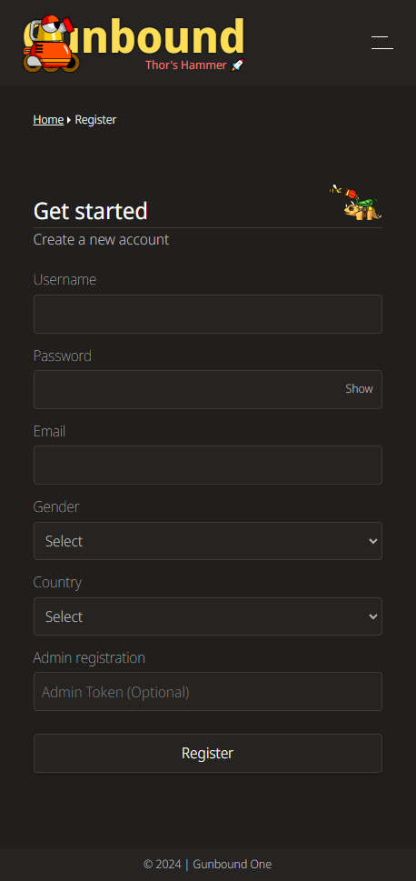
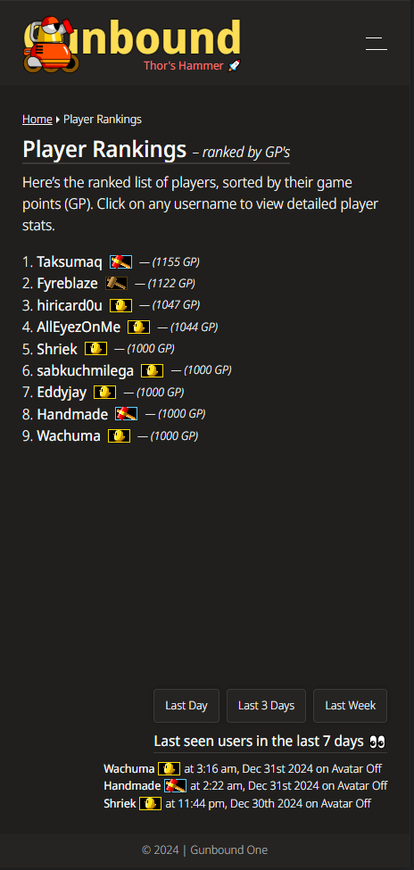
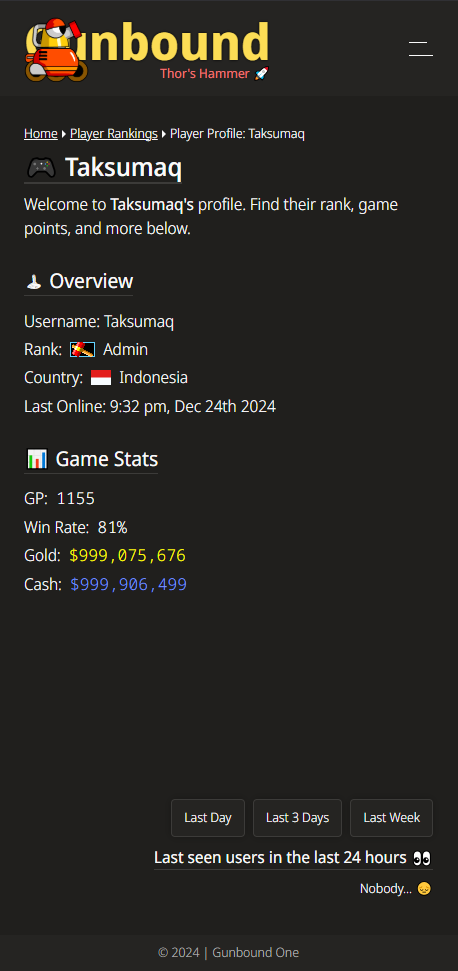

# Frontend for Gunbound Thor's Hammer 🚀

### **1. Project Overview**
This project is a modernized **frontend for Gunbound Thor’s Hammer**, a beloved game that has been revived using a custom game server. The frontend handles user registration, player rankings, and general game information, providing a clean and responsive interface for players to interact with the game. The backend server is built using **Node.js and Express** and relies on **MySQL 5.1.36** for data persistence.

---

### **2. Tech Stack**
- **Frontend Framework:** React (using Vite for fast builds)
- **Routing:** React Router v7
- **State Management:** Context API (for authentication)
- **Styling:** SASS
- **HTTP Client:** Axios
- **Date/Time Formatting:** date-fns

---

### **3. Key Features**
- **Home Page:** Overview of the game and navigation links.
- **Registration Page:**
  - Users can register by filling out details like username, email, password, gender, and country.
  - Admin token support for privileged registrations.
  - Error handling for server-side validation errors.
- **Player Rankings:**
  - Displays a ranked list of players sorted by Game Points (GP).
  - Ranks include labels (e.g., "Admin", "Wood Hammer") with icons.
  - Links to detailed player profiles.
- **Last Seen Users:**
  - Shows a list of users who were last online, with filters for last day, last 3 days, and last week.
- **Breadcrumb Navigation:** Indicates the user's current location within the app.
- **Reusable Layout Components:** Includes `Header`, `Footer`, and a custom `LastSeenUsers` component.

---

### **4. Installation & Setup**

#### **Prerequisites**
- Node.js and npm (or yarn) installed
- Backend server running (API endpoints must be available)

#### **Steps:**
1. **Clone the Repository:**
   ```bash
   git clone <your-repository-url>
   cd gunbound-frontend
   ```

2. **Install Dependencies:**
   ```bash
   npm install
   ```

3. **Set Up Environment Variables:**
   Create a `.env` file in the root directory and add:
   ```env
   VITE_API_BASE_URL=http://localhost:5000/api  # Replace with your backend API URL
   ```
   Replace `localhost:5000` with the appropriate backend server URL if it's different.

4. **Run the Development Server:**
   ```bash
   npm run dev
   ```
   The app should now be accessible at `http://localhost:5173/` (or the port assigned by Vite).

5. **Build for Production:**
   ```bash
   npm run build
   ```

6. **Preview the Production Build:**
   ```bash
   npm run preview
   ```

---

### **5. File Structure**
Here’s an overview of the main files:

```
src/
│
├── components/
│   ├── Breadcrumbs.jsx        // Breadcrumb navigation
│   ├── LastSeenUsers.jsx      // Shows last seen players
│   ├── Layout.jsx             // Layout with header, footer, and main content
│   ├── RegisterForm.jsx       // Registration form with validation
│   └── PlayerList.jsx         // Displays player rankings
│
├── pages/
│   ├── Home.jsx               // Main landing page
│   ├── Instructions.jsx       // Game joining instructions
│   └── PlayerDetails.jsx      // Detailed player profile page
│
├── context/
│   └── AuthContext.jsx        // Context for managing user authentication
│
├── routes/
│   └── AppRoutes.jsx          // Application routes using React Router
│
└── assets/
    └── images/                // Contains static assets like GIFs and icons
```

---

### **6. Features in Detail**

#### **Registration Form**
- Inputs for username, password, email, gender, country, and optional admin token.
- Password visibility toggle for convenience.
- Success message displayed with an animation upon successful registration.

#### **Player Rankings Page**
- Displays a sorted list of players by GP (Game Points).
- Player profile links and rank badges.

#### **Last Seen Users**
- Shows a list of players who were last seen online, with time filters.
- Animated loader while data is fetched.
- If no users are found for the selected timeframe, a "Nobody... 😔" message is shown.

---

### **7. Development Notes**

- **API Endpoints:**  
  The app communicates with the backend through endpoints like:
  - `POST /users/register`: Handles user registration.
  - `GET /users`: Retrieves player ranking data.
  - `GET /users/last-seen?days=X`: Retrieves last seen users within the specified timeframe.

- **SASS Styling:**  
  SASS is used for styling, and global classes are applied to the `<body>` using custom hooks like `usePageBodyClass()` to style different pages uniquely.

---

### **8. Potential Security Enhancements**
- **Input Validation:** Ensure that backend input validation matches the fields used in the registration form.
- **Environment Variables:** Avoid committing `.env` files to public repositories to keep API keys secure.

---

### **9. Dependencies**
The project’s main dependencies (from `package.json`) are:
```json
{
  "axios": "^1.7.9",
  "date-fns": "^4.1.0",
  "react": "^18.3.1",
  "react-router-dom": "^7.0.2",
  "sass": "^1.83.0"
}
```

---

### **10. Contribution Guidelines**
- Fork the repository and create a new branch for any changes.
- Submit a pull request with a clear description of the changes.
- Run `npm run lint` before committing to ensure code consistency.

---

### **11. License**
Specify your license here (e.g., MIT, GPL).

---

### **12. Screenshots**

### Registration Page


### Player Rankings Page


### Player Profile
